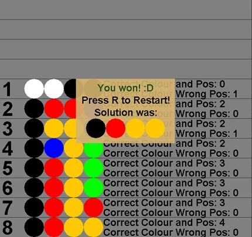

# 1.1 Master Mind Game Clone Overview

**Overview written by Peter Mitchell.**

## Contents

```
1.1 Master Mind Game Clone Overview
1.2 Introduction
1.3 The Rules of Master Mind 
1.4 High Level Discussion About Implementation
1.5 How the Core Game Works
1.6 Features You Could Add 
```
# 1.2 Introduction

This document will explain the fundamentals of how the Master Mind game works.

# 1.3 The Rules of Master Mind

Master Mind has a simple set of rules to control the flow of play. The following summarises the rules.

- The game starts with one player hiding a puzzle combination made up of some number of
    possible colours with some length of puzzle.
- The other player’s goal is to guess what the combination is. This is done by guessing complete
    combinations to match the solution.
- After submitting combinations, the guessing player is told how many of the pattern is correct
    position and colour, and how many are the right colour, but in the wrong position.
- The game ends when either the guessing player correctly guesses the solution, or when the
    guessing player runs out of a maximum number of guesses.


# 1.4 High Level Discussion About Implementation



Implementation of this game is set up to have the “player” setting the solution controlled by the player
to randomly create solutions. The player is playing it as a single player game where they are trying to
guess correctly.


In the image above you can see labels A, B, and C. This shows how the interface is built where A is the
attempt number, B is the puzzle combination, and C is the information about how close the attempt
was. You can see from this image and the image further up that the new attempts are inserted at the
bottom, and the submit button hides the result information for the current attempt. The submit
button is hidden when the overlay showing the game is over appears. Only the bottom row is
interactable where you can click on the colours with left or right mouse button to cycle them, and
submit will validate your solution to tell you if it is correct as seen in C, or via a dialogue that appears
to tell you it was won.


Pressing C will make a cheat activate to toggle viewing the solution. This would appear like above
where it shows the solution in the same position it would be on the end dialogue. Pressing R at any
time will make it restart the game and pressing Escape will exit the game.

# 1.5 How the Core Game Works

The classes used to develop this include the following.

- Lowest level classes:
    o SimpleButton: A button that can be used to check for mouse clicks in a rectangle with
       optional drawn background. It is used for detecting clicks to change the combination.
    o SimpleTextButton: Extends the SimpleButton to add centred text. Used for the Submit
       button.
- Attempt panel classes:
    o AttemptPanel: Combines drawing of the attempt number, PuzzleCombination, and
       ResultPanel for a single line of the interface.
    o PuzzleCombination: Used to represent either the combination for an attempt, or the
       solution.
    o ResultPanel: Draws the text showing how many matches were found in the attempt.
- GamePanel classes:
    o GamePanel: Controls the game state while managing a list of AttemptPanel objects.
       When the game ends it will display the GameEndedPanel.
    o GameEndedPanel: A dialogue to show if the game was won or lost.
- Starting the game:
    o Game: Creates the JFrame and populates it with a GamePanel. Also passes
       information about keys that are pressed to the GamePanel.

You can view the code to browse how the different elements are implemented with full comments
provided.


# 1.6 Features You Could Add

The current implementation is very simple. It has many different things you can change. The following
list summarises some of the things you could try changing.

- Change some of the properties to test how the game works with different settings. These
    constant variables can be changed to automatically update the game to change how it works.
       o PuzzleCombination.ID_TO_COLOUR
          You can add or remove colours to add or remove how many different options there
          are for combinations. It is provided with 6 colours, but you could try seeing how the
          game changes if you were to have 2,3,4,5,7,8,9,10 different colours.
       o PuzzleCombination.COMBINATION_LENGTH
          This is the number of elements in the puzzle. The default is 4, you could try with
          changing it to 5 or some other number.
       o GamePanel.MAXIMUM_ATTEMPTS
          This is the number of attempts shown as the amount of space on screen. By default,
          this is 12, but you could try changing this to other amounts.
       o A note though on changing these variables. You will need to consider the impact of
          how many combinations it will require and make that proportional to the number of
          attempts. You also need to consider how much screen space is available. With the
          current implementation it sizes itself to show everything.
          With the default settings you would for example have 6*6*6*6 = 1296 possible
          combinations. Or if you change the COMBINATION_LENGTH to 5 it would be
          6*6*6*6*6 = 7776.
- Improve the visuals of the game. You could change the text result information to show as
    something more interesting like black circles for each of one and white for each of the other.
- Add a multiplayer mode where another player can set the combination while the guesser does
    not look at the screen. You could take this a step further by making this work in an online
    game, but that is a significant amount of work.
- Create an AI that can solve the puzzles by using a minmax type algorithm.
- Create a new rule or element for the game to add to the existing rules or change something
    about them to make the game unique.


